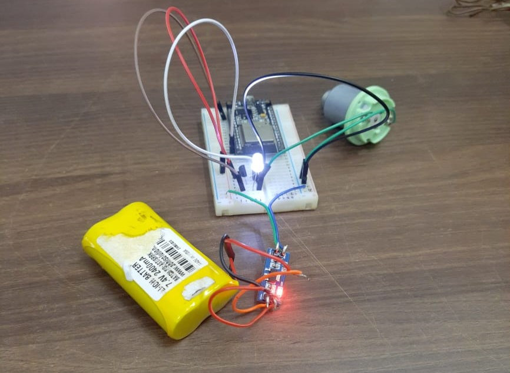
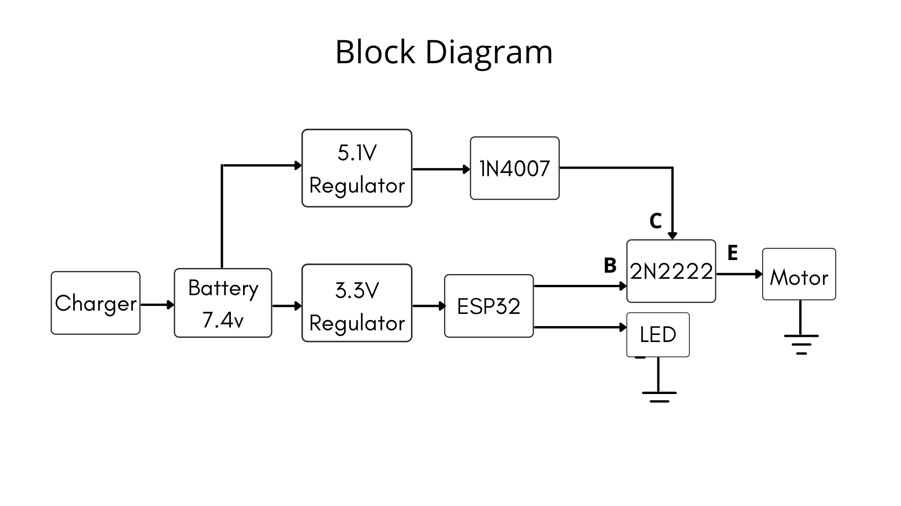

# IoT_vibration_alert
 IoT based assistive vibration alert device

Hey all,
	We have started working on this project on 10 April 2021. The device is being made to install in the library of NISH - National Institute of Speach and 
Hearing, Kerala, India. The hardware setup will be installed on the surface of reading table and will be connected to the local network. The librarian whose mobile
phone is connected to the same network can control the device using the mobile application. With the press of a button on the app, the device will vibrate for
1 minute. The disabled people can sense this vibration and they can be alerted.
	
	We are working with the ESP32 development board and has conrolled the device using blynk app on 10 April 2020.

	

Works on first day:-

Component listing
block diagram 1 (transistor switch with separated GND)
/nblock diagram 2 (transistor switch with separated 5V)
Motor control logic development and testing
ESP32 LED blinking
ESP32 motor control
ESP32 blynk app interface
ESP32 blynk app motor control

