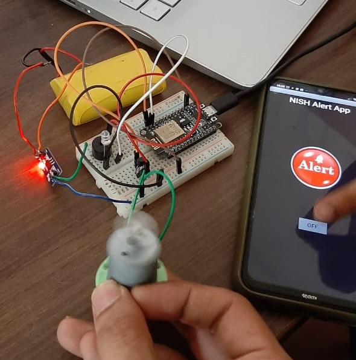

# IoT_vibration_alert
 IoT based assistive vibration alert device

Hey all,
	We have started working on this project on 10 April 2021. The device is being made to install in the library of NISH - National Institute of Speach and 
Hearing, Kerala, India. The hardware setup will be installed on the surface of reading table and will be connected to the local network. The librarian whose mobile
phone is connected to the same network can control the device using the mobile application. With the press of a button on the app, the device will vibrate for
1 minute. The disabled people can sense this vibration and they can be alerted.
	

Works on first day (10 April 2021):-

1. block diagram 1 (transistor switch with separated GND)
2. block diagram 2 (transistor switch with separated 5V)
3. Motor control logic development and testing
4. ESP32 LED blinking
5. ESP32 motor control
6. ESP32 blynk app interface
7. ESP32 blynk app motor control

Works on second day (17 April 2021):-

1. Implemented the project using NodeMCU
2. Created an app on MIT appinventor
3. Fabricated the power supply and regulator system
4. Designed the case in Fusion 360. [See it here](https://a360.co/3dAogpn)

